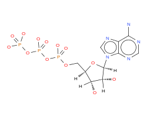

Energy Currency and ATP Hydrolysis 
==========================================================

   Adenosine Triphosphate (ATP)

ATP is considered the energy "currency" of the cell. But how much is that currency worth? How much energy is in an ATP hydrolysis reaction? The hydrolysis of one phosphoanhydride bond to form ADP and phosphate

|atp_hydrolysis|_

.. |atp_hydrolysis| replace:: ATP + H\ :sub:`2`\ O ⇌ ADP + Pi
.. _atp_hydrolysis: http://equilibrator.weizmann.ac.il/search?query=ATP+%2B+Water+%3C%3D%3E+ADP+%2B+Phosphate

has a Δ\ :sub:`r`\ G'° of about -26 kJ / mol. That is, if you hydrolyze 1 mol of ATP to ADP in standard conditions, 26 kJ of energy that is usable for work is released. Conversely, it takes 26 kJ of work to form 1 mol of ATP from ADP in standard conditions.

Keep in mind that Δ\ :sub:`r`\ G'° is defined in standard conditions (1 molar concentrations) while biological concentrations are much closer to 1 millimolar (1 mM). We can calculate the Δ\ :sub:`r`\ G' in these conditions using one of the most basic equations of biochemical thermodynamics

.. math::
	\begin{eqnarray}
	\Delta_r G' &=& \Delta_r G'^{\circ} + RT \ln{Q} \\
	&=& \Delta_r G'^{\circ} + RT \ln{\left( \frac{[ATP][Pi]}{[ADP][H_2O]} \right)}
	\end{eqnarray}

Here Q is the ratio of product concentrations to substrate concentrations for the ATP hydrolysis reaction - concentrations are denoted by square brackets like [ATP]. [1]_ Q is called the "reaction quotient" or sometimes the "mass-action ratio" in textbooks. Because biology takes place in water, [H\ :sub:`2`\ O] is assumed to be 1 molar. If we set the other three concentrations to 10\ :sup:`-3` molar we get

.. math::
	\begin{eqnarray}
	\Delta_r G' &=& \Delta_r G'^{\circ} + RT \ln{\left( \frac{10^{-3} \times 10^{-3}}{10^{-3}} \right)} \\
	&=& \Delta_r G'^{\circ} + RT \ln{10^{-3}} \\
	&\approx& \Delta_r G'^{\circ} - 17.1 \frac{kJ}{mol}
	\end{eqnarray}

Since R = 8.315 x 10\ :sup:`-3` kJ/mol/K and we assume a temperature of T = 298.15 K (25 °C). [2]_ This calculation gives a Δ\ :sub:`r`\ G' value around -44 kJ/mol. Try using eQuilibrator to verify this. [3]_ We call this value the Δ\ :sub:`r`\ G'\ :sup:`m` - the Δ\ :sub:`r`\ G' value when all reactants have 1 mM concentration. We will often use this value instead of Δ\ :sub:`r`\ G'° in this document and on eQuilibrator because 1 mM concentrations are much more representative of small molecule concentrations inside cells than the usual 1 M standard.

We can also convert the energy of ATP hydrolysis into other units, for example units of mechanical force relevant on the molecular scale: piconewton nanometers (pN nm). Looking up the `definitions of these units <https://en.wikipedia.org/wiki/KT_(energy)>`_, we find that 1 pN nm = 10-24 kJ and so 1 pN nm / mol = 0.6 kJ / mol. This gives us roughly 73 pN nm per ATP hydrolysis (Phillips et al., 2009). But how much energy is that? Well, it’s more than enough to `compact DNA <http://bionumbers.hms.harvard.edu/bionumber.aspx?id=103125>`_ into a viral capsid, for example. In other words, ATP stores an amount of energy that can be converted into a usable amount of work at the molecular scale. ATP acts as a bridge between the chemical and physical realms - between energy metabolism and the mechanical work of living.

Moreover, ATP serves a crucial role in metabolism. As we will see throughout this document, cells often want to perform metabolic transformations that are not intrinsically favorable (reactions that are "uphill" energetically). Through evolution and natural selection, cells "learned" how to make these transformations "go" by coupling them to highly favorable reactions like the hydrolysis of ATP. So remember the energey scale of ATP hydrolysis - about 45 kJ/mol - since we will often use that scale to determine how many ATPs will be needed to make some biochemical reaction go in the direction the cell wants it to.

.. [1] Notice that Q is unitless for this reaction because it has the same number of substrates and products. In fact Q *must* unitless so that we can take its logarithm. 
.. [2] We assume T = 25 °C = 298.15 K throughout eQuilibrator. We don't curretly have enough information about the temperature dependence of Δ\ :sub:`r`\ G'° to remove this assumption.
.. [3] Hint: click on the ATP hydrolysis reaction above.