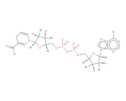

Glycolysis and Fermentation
==========================================================

.. todo:: Elad's glycolysis figure goes in here somewhere.

The reason that complete glucose oxidation produces so much energy is that molecular oxygen has a strong "preference" to accept electrons (very high reduction potential). This preference of electrons to flow to oxygen is so powerful that it can be used to drive the formation of several molecules of ATP through a process is called oxidative phosphorylation or `respiration <respiration.html>`_. In anaerobic conditions, however, oxygen is not available (by definition) and it's not possible to drive oxidative phosphorylation by donating electrons to O\ :sub:`2`.

The anaerobic breakdown of glucose for energy production is called fermentation. Several approaches to fermenting glucose occur in nature, but we'll start by discussing a relatively simple one: fermentation of glucose to lactate. Fermentation of glucose begins in the same way that complete oxidation of glucose does: by breaking glucose down into two pyruvate molecules through a process known as glycolysis:

`Glucose ⇌ 2 Pyruvate <http://equilibrator.weizmann.ac.il/search?query=Glucose+%3D%3E+2+Pyruvate>`_

If you inspect this reaction in eQuilibrator, you'll notice that it is not "electron-balanced." That is, there are 4 fewer electrons in two pyruvate molecules than there are in one glucose molecule. Really, we should write this reaction as a “half-reaction” 

`Glucose ⇌ 2 Pyruvate + 4 e- <http://equilibrator.weizmann.ac.il/search?query=Glucose+%3D%3E+2+Pyruvate+%2B+4+e->`_

In order track the electrons explicitly. These electrons don't just float around the cell: they are carried by specific compounds called electron carriers. In glycolysis, the electron carrier of choice is nicotinamide adenine dinucleotide (NAD). To fix the electron imbalance, try clicking on the "Balance with NAD+/NADH" link.

   Reduced Nicotinamide Adenine Dinucleotide (NADH)

The full glycolysis reaction, including electron carriers and ATP production is:

|glycolysis_net|_

.. |glycolysis_net| replace:: Glucose + 2 NAD+ + 2 ADP + 2 Pi ⇌ 2 Pyruvate + 2 NADH + 2 ATP + 2 H\ :sub:`2`\ O
.. _glycolysis_net: http://equilibrator.weizmann.ac.il/search?query=Glucose+%2B+2+NAD%2B+%2B+2+ADP+%2B+2+Phosphate+%3C%3D%3E+2+Pyruvate+%2B+2+NADH+%2B+2+ATP+%2B+2+H2O

Clearly glycolysis produces ATP without any oxygen. However, if you ran glycolysis over and over again to provide ATP, the amount of NADH in the cell would grow continually. The ratio of NAD+ concentration to NADH concentration - sometimes called the "redox state" - is very important to living cells because it affects the energetics of redox reactions, in particular in glycolysis. In order to keep this ratio constant (homeostasis), the electrons stored in NADH need to move on to a different molecule. Fermentation to lactate solves this problem by taking the electrons carried by NADH and giving them to pyruvate to form lactate:

`2 Pyruvate + 2 NADH ⇌ 2 Lactate + 2 NAD+ <http://equilibrator.weizmann.ac.il/search?query=2+Pyruvate+%2B+2+NADH+%3C%3D%3E+2+Lactate+%2B+2+NAD%2B>`_

Since lactate build-up is problematic (in much the same way that NADH build up is) the lactate is then excreted from the cell. Fermentation to lactate, then, produces 2 ATP from one glucose while forming 2 lactate:

|glycolysis_atp_net|_

.. |glycolysis_atp_net| replace:: Glucose + 2 ADP + 2 Pi ⇌ 2 Lactate + 2 ATP + 2 H\ :sub:`2`\ O
.. _glycolysis_atp_net: http://equilibrator.weizmann.ac.il/search?query=Glucose++%2B+2+ADP+%2B+2+Phosphate+%3C%3D%3E+2+Lactate+%2B+2+ATP+%2B+2+H2O

This neat biochemical trick enables organisms as varied as *E. coli* and humans to produce energy from sugars even when oxygen isn't available.

NADH as an Electron Carrier
----------------------------------------------------------

Many reactions in metabolism redox reactions (reduction/oxidation reactions) involving the transfer of electrons between molecules. One classic such reaction is the lactate dehydrogenase reaction described above. 

`NADH + Pyruvate ⇌ NAD+ + Lactate <http://equilibrator.weizmann.ac.il/search?query=NADH+%2B+Pyruvate+%3C%3D%3E+NAD%2B+%2B+Lactate>`_

We can identify that this is a redox reaction from the presence of the two-electron carrier NAD+/NADH. One way to understand the energetics of redox reactions is to split them into “half-reactions.”

`Pyruvate + 2e- ⇌ Lactate <http://equilibrator.weizmann.ac.il/search?query=Pyruvate+%3C%3D%3E+Lactate>`_ (E'\ :sup:`m` ≈ -190 mV)

`NADH ⇌ NAD+ + 2e- <http://equilibrator.weizmann.ac.il/search?query=NADH+%3C%3D%3E+NAD%2B>`_ (E'\ :sup:`m` ≈ -330 mV)

If we add these two half-reactions together we see that the electrons balance and cancel: the two half-cells produce a balanced chemical reaction. 

The energetics of these half-reactions can be characterized by a number called the “reduction potential,” given above as E'\ :sup:`m`. What do these reduction potentials mean? The -190 mV E'\ :sup:`m` given for converting pyruvate to lactate represents the amount of energy that each electron needs to carry in order to convert pyruvate into lactate assuming, as above, 1 mM concentrations for pyruvate and lactate (denoted by the m superscript). Here, for example, we have to donate 2 e- to pyruvate to form lactate and each electron must carry roughly -190 mV of potential. 

The reduction potential is relative value - in order to know whether the pyruvate/lactate half-reaction will be favorable, we need to know where electrons came from. We can tell that NADH is a suitable donor for this reaction because the electrons in NADH have a potential of -330 mV. Electrons flow towards more positive potentials, and so we can tell that donating electrons from NADH to pyruvate to form NAD+ and lactate will be favorable - each electron gains about 140 mV of potential. 

We can convert these mV values into more familiar kJ/mol using the Nernst equation

.. math::
	\begin{eqnarray}
	\Delta_r G' &=& n F \Delta E \\
	F &\approx& 96.4 \times 10^3 \frac{kJ}{mV mol}
	\end{eqnarray}

where n is the number of electrons transferred and F is the Faraday constant. Reducing pyruvate using NADH (i.e. donating electrons from NADH to pyruvate) will therefore have a 

.. math::
	\Delta_r G'^m \approx 2 \times 96.4 \times 10^{-3} \times (-330 - 190) \approx -27 \frac{kJ}{mol}

consistent with our earlier calculation of Δ\ :sub:`r`\ G\ :sup:`m` using eQuilibrator. 

There are many common biological electron carriers aside from NADH and its close cousin NADPH. These include ferredoxin, glutathione, quinones and various flavins. But NAD(P)H is the most common biological electron carrier for a number of reasons. Most importantly, molecular oxygen (O\ :sub:`2`) is abundant in our atmosphere and has a very high reduction potential (Nelson et al., 2008). Many biological electron carriers can spontaneously donate electrons to O\ :sub:`2` and so must be “protected” from oxygen in various ways (e.g. by being buried deep inside proteins). As compared to other biological electron carriers, NAD(P)H is relatively insensitive to O\ :sub:`2` (Nelson et al., 2008). NADH is also a two electron carrier, which is suited to many metabolic reactions where electrons are often transferred in pairs. Finally, the reduction potential of NAD(P)H around -320 mV is well-suited to many common biological transformations, which mainly alter the “redox state” (number of electrons) associated with carbon atoms (Bar-Even et al., 2012). 

Ethanol Fermentation
----------------------------------------------------------

Fermentation isn’t limited to making lactate - cells can produce anything that is “redox neutral” relative to their growth substrate (i.e. has the same total number of electrons as glucose). So long as the product has the same number of electrons as the substrate, the process doesn’t force accumulation of reduced electron carriers like NADH and is called fermentation. Ethanol is a famous and important fermentation product of glucose - one that is imbibed and used as a fuel additive worldwide. 

We can use eQuilibrator to check that ethanol production is in fact redox neutral (relative to glucose) by searching for the reaction producing ethanol from pyruvate

|pyr_eth_half|_

.. |pyr_eth_half| replace:: 2 pyruvate + 4 e- ⇌ 2 ethanol + 2 CO\ :sub:`2`
.. _pyr_eth_half: http://equilibrator.weizmann.ac.il/search?query=2+pyruvate+%3D+2+ethanol+%2B+2+CO2

This reaction is categorized as a “half-reaction” by eQuilibrator, meaning that there are excess electrons on one side of the reaction. The 4 electrons required can be withdrawn from NADH as discussed above (eQuilibrator does this automatically if you click the “Balance with NAD+/NADH” link).

|pyr_eth_net|_

.. |pyr_eth_net| replace:: 2 Pyruvate + 2 NADH ⇌ 2 Ethanol + 2 CO\ :sub:`2` + 2 NAD+
.. _pyr_eth_net: http://equilibrator.weizmann.ac.il/reaction?reactantsId=C00022&reactantsCoeff=-2&reactantsName=Pyruvate&reactantsPhase=aqueous&reactantsConcentration=0.001&reactantsId=C00469&reactantsCoeff=2&reactantsName=Ethanol&reactantsPhase=aqueous&reactantsConcentration=0.001&reactantsId=C00011&reactantsCoeff=2&reactantsName=CO2&reactantsPhase=aqueous&reactantsConcentration=0.001&reactantsId=C00004&reactantsCoeff=-2&reactantsName=NADH&reactantsPhase=aqueous&reactantsConcentration=0.001&reactantsId=C00003&reactantsCoeff=2&reactantsName=NAD+&reactantsPhase=aqueous&reactantsConcentration=0.001&ph=7.000000&pmg=14.000000&ionic_strength=0.100000&e_reduction_potential=0.000000&max_priority=0&mode=BA&query=2%20pyruvate%20%3D%202%20ethanol%20%2B%202%20CO2

As with lactate, we see that production of ethanol from two pyruvate molecules perfectly balances the production of two pyruvate from glucose -- glucose breakdown produces two NADH and ethanol production consumes them both. As a result, the NADH cancel and the net reaction for ethanol fermentation contains no electron carriers.

|ethanol_ferm_net|_

.. |ethanol_ferm_net| replace:: Glucose ⇌ 2 Ethanol + 2 CO\ :sub:`2`
.. _ethanol_ferm_net: http://equilibrator.weizmann.ac.il/reaction?query=glucose+%3D+2+ethanol+%2B+2+co2&reactantsCoeff=-1&reactantsId=C00031&reactantsName=Glucose&reactantsConcentration=1&reactantsConcentrationPrefactor=0.001&reactantsPhase=aqueous&reactantsCoeff=2&reactantsId=C00469&reactantsName=Ethanol&reactantsConcentration=1&reactantsConcentrationPrefactor=0.001&reactantsPhase=aqueous&reactantsCoeff=2&reactantsId=C00011&reactantsName=CO2&reactantsConcentration=1&reactantsConcentrationPrefactor=0.001&reactantsPhase=aqueous

Indeed, production of ethanol and CO\ :sub:`2` from pyruvate is quite favorable (Δ\ :sub:`r`\ G'm = -114 kJ / mol) which helps explain why yeast are so content to make large quantities of ethanol for our enjoyment. 

Mixtures of Fermentation Products
----------------------------------------------------------

Bacteria produce many different kinds of fermentation products. The only requirement is that the products of a fermentation pathway contain the same number of electrons as the substrates. Indeed, as we saw with ethanol fermentation, it’s possible to make multiple fermentation products (ethanol + CO\ :sub:`2`) so long as redox balance is preserved.

In mixed fermentation, cells produce (surprise!) a precise mixture of products that together are redox balanced with their substrate. *E. coli*, for example, can use this strategy to make an extra ATP by converting pyruvate to a 1:1:1 mixture of acetate, ethanol and formate. 

|ma_ferm_net|_

.. |ma_ferm_net| replace:: 2 Pyruvate + 2 NADH + H\ :sub:`2`\ O ⇌ Acetate + Ethanol + 2 Formate + 2 NAD+
.. _ma_ferm_net: http://equilibrator.weizmann.ac.il/reaction?reactantsId=C00022&reactantsCoeff=-2&reactantsName=Pyruvate&reactantsPhase=aqueous&reactantsConcentration=0.001&reactantsId=C00033&reactantsCoeff=1&reactantsName=Acetate&reactantsPhase=aqueous&reactantsConcentration=0.001&reactantsId=C00469&reactantsCoeff=1&reactantsName=Ethanol&reactantsPhase=aqueous&reactantsConcentration=0.001&reactantsId=C00058&reactantsCoeff=2&reactantsName=Formate&reactantsPhase=aqueous&reactantsConcentration=0.001&reactantsId=C00004&reactantsCoeff=-2&reactantsName=NADH&reactantsPhase=aqueous&reactantsConcentration=0.001&reactantsId=C00003&reactantsCoeff=2&reactantsName=NAD+&reactantsPhase=aqueous&reactantsConcentration=0.001&reactantsId=C00001&reactantsCoeff=-1&reactantsName=H2O&reactantsPhase=liquid&reactantsConcentration=1&ph=7.000000&pmg=14.000000&ionic_strength=0.100000&e_reduction_potential=0.000000&max_priority=0&mode=BA&query=2%20Pyruvate%20%2B%20H2O%20%3C%3D%3E%20Acetate%20%2B%20Ethanol%20%2B%202%20formate

Formate is fairly toxic, so it is subsequently converted to CO\ :sub:`2` and molecular hydrogen by an enzyme called formate hydrogenlyase

|formate_co2|_

.. |formate_co2| replace:: Formate ⇌ CO\ :sub:`2` + H\ :sub:`2`
.. _formate_co2: http://equilibrator.weizmann.ac.il/search?query=Formate+%3D+CO2+%2B+H2

Considering the net reaction of this process in eQuilibrator 

|ma_ferm_net_h2|_

.. |ma_ferm_net_h2| replace:: 2 Pyruvate + 2 NADH + H :sub:`2` O ⇌ Acetate + Ethanol + 2 CO\ :sub:`2` + 2 NAD+ + 2 H\ :sub:`2`
.. _ma_ferm_net_h2: http://equilibrator.weizmann.ac.il/search?query=2+Pyruvate+%2B+2+NADH+%2B+H2O+%3C%3D%3E+Acetate+%2B+Ethanol+%2B+2+CO2+%2B+2+NAD%2B+%2B+2+H2

We see that it has a Δ\ :sub:`r`\ G'm around -100 kJ/mol, more than sufficient to make an additional ATP. Altogether, the net reaction from glucose makes 3 ATP and is still quite favorable

|ma_ferm_net_atp|_

.. |ma_ferm_net_atp| replace:: Glucose + 3 ADP + 3 Pi ⇌ Acetate + Ethanol + 2 CO\ :sub:`2` + 2 H\ :sub:`2` + 3 ATP + 2 H\ :sub:`2`\ O
.. _ma_ferm_net_atp: http://equilibrator.weizmann.ac.il/reaction?reactantsId=C00031&reactantsCoeff=-1&reactantsName=Glucose&reactantsPhase=aqueous&reactantsConcentration=0.001&reactantsId=C00008&reactantsCoeff=-3&reactantsName=ADP&reactantsPhase=aqueous&reactantsConcentration=0.001&reactantsId=C00009&reactantsCoeff=-3&reactantsName=Pi&reactantsPhase=aqueous&reactantsConcentration=0.001&reactantsId=C00033&reactantsCoeff=1&reactantsName=Acetate&reactantsPhase=aqueous&reactantsConcentration=0.001&reactantsId=C00469&reactantsCoeff=1&reactantsName=Ethanol&reactantsPhase=aqueous&reactantsConcentration=0.001&reactantsId=C00011&reactantsCoeff=2&reactantsName=CO2&reactantsPhase=aqueous&reactantsConcentration=0.001&reactantsId=C00282&reactantsCoeff=2&reactantsName=H2&reactantsPhase=aqueous&reactantsConcentration=0.001&reactantsId=C00002&reactantsCoeff=3&reactantsName=ATP&reactantsPhase=aqueous&reactantsConcentration=0.001&reactantsId=C00001&reactantsCoeff=2&reactantsName=H2O&reactantsPhase=liquid&reactantsConcentration=1&ph=7.000000&pmg=14.000000&ionic_strength=0.100000&e_reduction_potential=0.000000&max_priority=0&mode=BA&query=Glucose%20%2B%203%20ADP%20%2B%203%20Pi%20%2B%20H2O%20%3C%3D%3E%20Acetate%20%2B%20Ethanol%20%2B%202%20CO2%20%2B%202%20H2%20%2B%203%20ATP

So how does *E. coli* get an extra ATP out of this transformation from pyruvate to acetate, ethanol and formate? To see how, consider the conversion of pyruvate to acetate, which takes place in the following 3 steps 

#. `CoA + Pyruvate ⇌ Acetyl-CoA + Formate <http://equilibrator.weizmann.ac.il/reaction?query=Acetyl-CoA+%2B+Formate+%3C%3D%3E+CoA+%2B+Pyruvate&ph=7.0&ionic_strength=0.1&reactantsCoeff=1.0&reactantsId=C00010&reactantsName=CoA&reactantsConcentration=1&reactantsConcentrationPrefactor=0.001&reactantsPhase=aqueous&reactantsCoeff=1.0&reactantsId=C00022&reactantsName=Pyruvate&reactantsConcentration=1&reactantsConcentrationPrefactor=0.001&reactantsPhase=aqueous&reactantsCoeff=-1.0&reactantsId=C00024&reactantsName=Acetyl-CoA&reactantsConcentration=1&reactantsConcentrationPrefactor=0.001&reactantsPhase=aqueous&reactantsCoeff=-1.0&reactantsId=C00058&reactantsName=Formate&reactantsConcentration=1&reactantsConcentrationPrefactor=0.001&reactantsPhase=aqueous&max_priority=0&submit=Reverse>`_

#. `Acetyl-CoA + Pi ⇌ Acetyl-Phosphate + CoA <http://equilibrator.weizmann.ac.il/search?query=Acetyl-CoA+%2B+Pi+%3C%3D%3E+Acetyl-Phosphate+%2B+CoA>`_

#. `ADP + Acetyl phosphate ⇌ ATP + Acetate <http://equilibrator.weizmann.ac.il/reaction?query=ATP+%2B+Acetate+%3C%3D%3E+ADP+%2B+Acetyl+phosphate&ph=7.0&ionic_strength=0.1&reactantsCoeff=-1.0&reactantsId=C00002&reactantsName=ATP&reactantsConcentration=1&reactantsConcentrationPrefactor=0.001&reactantsPhase=aqueous&reactantsCoeff=1.0&reactantsId=C00008&reactantsName=ADP&reactantsConcentration=1&reactantsConcentrationPrefactor=0.001&reactantsPhase=aqueous&reactantsCoeff=-1.0&reactantsId=C00033&reactantsName=Acetate&reactantsConcentration=1&reactantsConcentrationPrefactor=0.001&reactantsPhase=aqueous&reactantsCoeff=1.0&reactantsId=C00227&reactantsName=Acetyl+phosphate&reactantsConcentration=1&reactantsConcentrationPrefactor=0.001&reactantsPhase=aqueous&max_priority=0&submit=Reverse>`_

Acetate is formed via the intermediate of acetyl-CoA, which allows for the production of ATP (as discussed above). Notice, however, that this 3-step pathway is redox neutral - it does not consume any of the NADH that would have been produced in glycolysis to make pyruvate. So *E. coli* can’t ferment glucose entirely to acetate and formate because that would not be a redox neutral transformation, as you can see by balancing the net reaction on eQuilibrator.

|ma_from_gluc|_

.. |ma_from_gluc| replace:: Glucose + 2 NAD+ + H\ :sub:`2`\ O ⇌ 2 Acetate + 2 Formate + 2 NADH
.. _ma_from_gluc: http://equilibrator.weizmann.ac.il/reaction?reactantsId=C00031&reactantsCoeff=-1&reactantsName=Glucose&reactantsPhase=aqueous&reactantsConcentration=0.001&reactantsId=C00033&reactantsCoeff=2&reactantsName=Acetate&reactantsPhase=aqueous&reactantsConcentration=0.001&reactantsId=C00058&reactantsCoeff=2&reactantsName=Formate&reactantsPhase=aqueous&reactantsConcentration=0.001&reactantsId=C00004&reactantsCoeff=2&reactantsName=NADH&reactantsPhase=aqueous&reactantsConcentration=0.001&reactantsId=C00003&reactantsCoeff=-2&reactantsName=NAD+&reactantsPhase=aqueous&reactantsConcentration=0.001&reactantsId=C00001&reactantsCoeff=-2&reactantsName=H2O&reactantsPhase=liquid&reactantsConcentration=1&ph=7.000000&pmg=14.000000&ionic_strength=0.100000&e_reduction_potential=0.000000&max_priority=0&mode=BA&query=Glucose%20%2B%202%20H2O%20%3C%3D%3E%202%20Acetate%20%2B%202%20Formate

Producing one ethanol for every acetate ensures that the overall fermentation pathway is redox balanced. This can be seen by considering how ethanol is made from pyruvate in this case 

#. `CoA + Pyruvate ⇌ Acetyl-CoA + Formate <http://equilibrator.weizmann.ac.il/reaction?query=Acetyl-CoA+%2B+Formate+%3C%3D%3E+CoA+%2B+Pyruvate&ph=7.0&ionic_strength=0.1&reactantsCoeff=1.0&reactantsId=C00010&reactantsName=CoA&reactantsConcentration=1&reactantsConcentrationPrefactor=0.001&reactantsPhase=aqueous&reactantsCoeff=1.0&reactantsId=C00022&reactantsName=Pyruvate&reactantsConcentration=1&reactantsConcentrationPrefactor=0.001&reactantsPhase=aqueous&reactantsCoeff=-1.0&reactantsId=C00024&reactantsName=Acetyl-CoA&reactantsConcentration=1&reactantsConcentrationPrefactor=0.001&reactantsPhase=aqueous&reactantsCoeff=-1.0&reactantsId=C00058&reactantsName=Formate&reactantsConcentration=1&reactantsConcentrationPrefactor=0.001&reactantsPhase=aqueous&max_priority=0&submit=Reverse>`_

#. `NADH + Acetyl-CoA ⇌ NAD+ + CoA + Acetaldehyde <http://equilibrator.weizmann.ac.il/reaction?query=NAD%2B+%2B+CoA+%2B+Acetaldehyde+%3C%3D%3E+NADH+%2B+Acetyl-CoA&ph=7.0&ionic_strength=0.1&reactantsCoeff=-1.0&reactantsId=C00003&reactantsName=NAD%2B&reactantsConcentration=1&reactantsConcentrationPrefactor=0.001&reactantsPhase=aqueous&reactantsCoeff=1.0&reactantsId=C00004&reactantsName=NADH&reactantsConcentration=1&reactantsConcentrationPrefactor=0.001&reactantsPhase=aqueous&reactantsCoeff=-1.0&reactantsId=C00010&reactantsName=CoA&reactantsConcentration=1&reactantsConcentrationPrefactor=0.001&reactantsPhase=aqueous&reactantsCoeff=1.0&reactantsId=C00024&reactantsName=Acetyl-CoA&reactantsConcentration=1&reactantsConcentrationPrefactor=0.001&reactantsPhase=aqueous&reactantsCoeff=-1.0&reactantsId=C00084&reactantsName=Acetaldehyde&reactantsConcentration=1&reactantsConcentrationPrefactor=0.001&reactantsPhase=aqueous&max_priority=0&submit=Reverse>`_

#. `NADH + Acetaldehyde ⇌ NAD+ + Ethanol <http://equilibrator.weizmann.ac.il/reaction?query=NAD%2B+%2B+Ethanol+%3C%3D%3E+NADH+%2B+Acetaldehyde&ph=7.0&ionic_strength=0.1&reactantsCoeff=-1.0&reactantsId=C00003&reactantsName=NAD%2B&reactantsConcentration=1&reactantsConcentrationPrefactor=0.001&reactantsPhase=aqueous&reactantsCoeff=1.0&reactantsId=C00004&reactantsName=NADH&reactantsConcentration=1&reactantsConcentrationPrefactor=0.001&reactantsPhase=aqueous&reactantsCoeff=1.0&reactantsId=C00084&reactantsName=Acetaldehyde&reactantsConcentration=1&reactantsConcentrationPrefactor=0.001&reactantsPhase=aqueous&reactantsCoeff=-1.0&reactantsId=C00469&reactantsName=Ethanol&reactantsConcentration=1&reactantsConcentrationPrefactor=0.001&reactantsPhase=aqueous&max_priority=0&submit=Reverse>`_

Notice that the production of ethanol from pyruvate in these three steps involves the consumption of 2 NADH. So if the cell makes exactly one ethanol molecule for every acetate, then redox balance will be preserved and one extra ATP will be made for every two pyruvates metabolized - a balancing act indeed!

There are several other pathways of this sort that produce a defined mixture of fermentation products that are collectively redox neutral compared to glucose. The pathways are termed “mixed acid fermentation pathways” because they usually produce a mixture of acids (Kim and Gadd, 2008). But this name can be confusing, as in the case of 1:1:1 production of acetate, ethanol and formate because not all of the products are acids (e.g. ethanol is an alcohol). You can learn more about the variety of mixed fermentation pathways on `Wikipedia <https://en.wikipedia.org/wiki/Mixed_acid_fermentation>`_ and `Biocyc <https://biocyc.org/META/NEW-IMAGE?type=PATHWAY&object=FERMENTATION-PWY>`_. 
